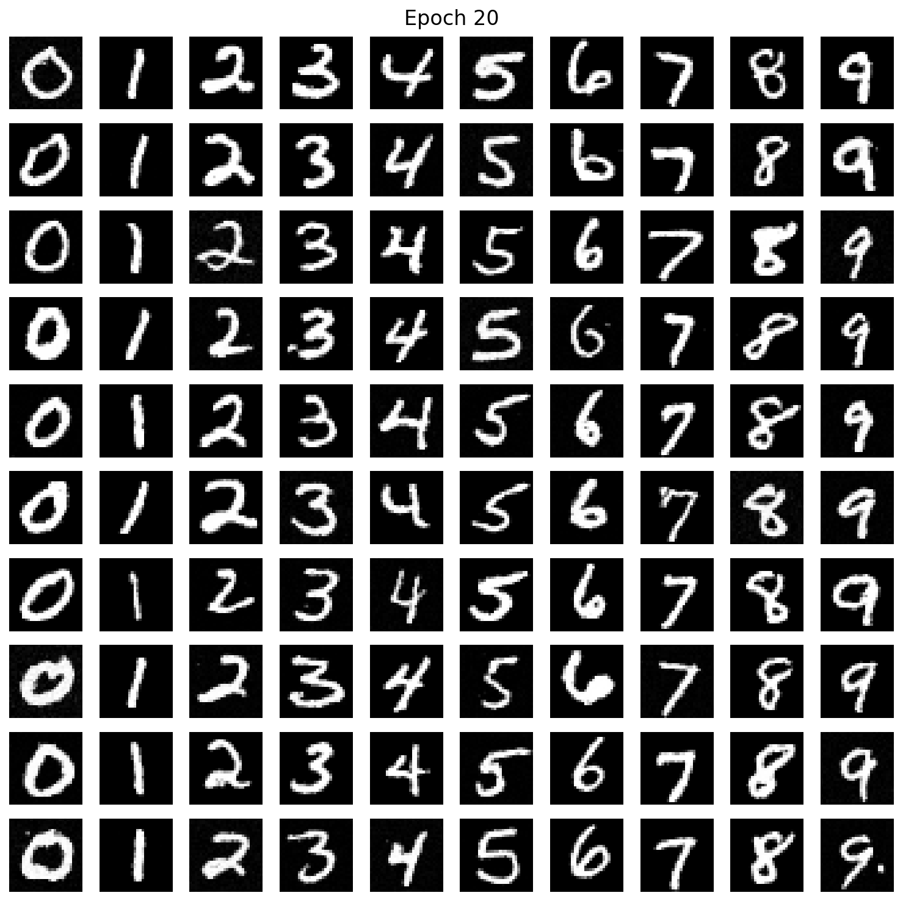
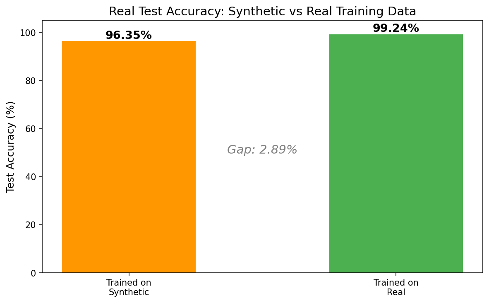
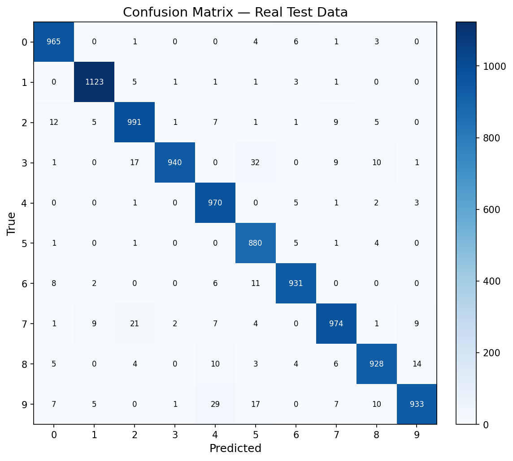
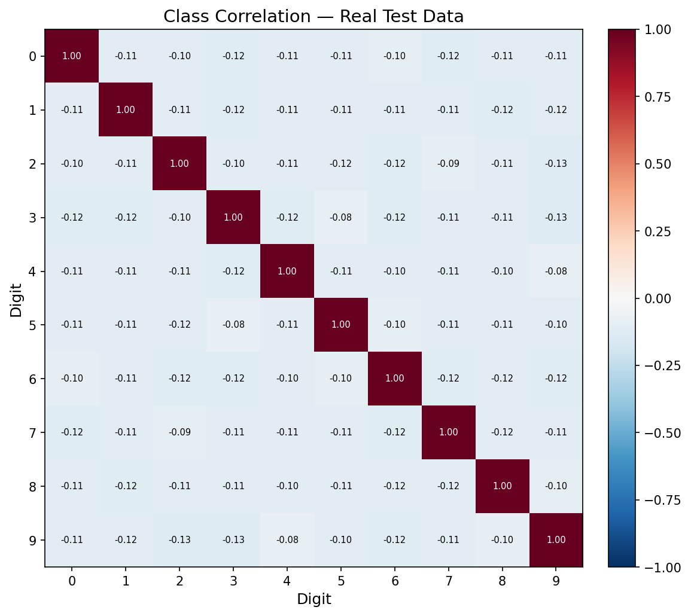
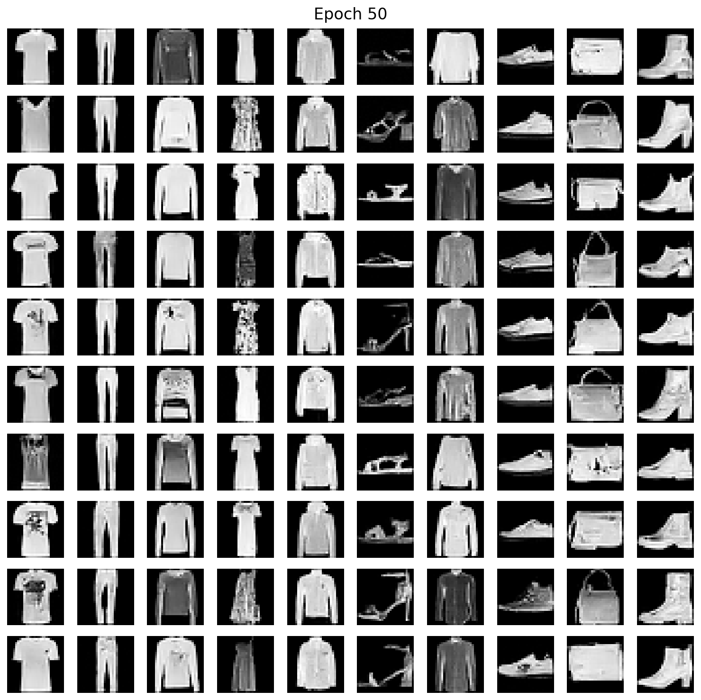
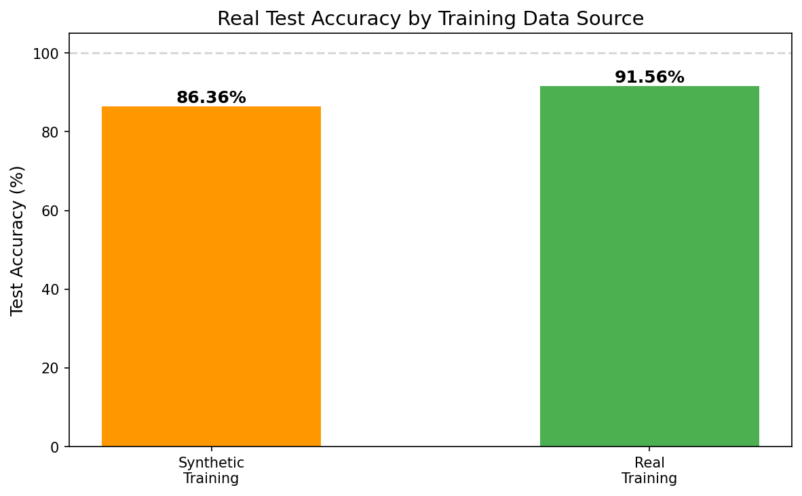
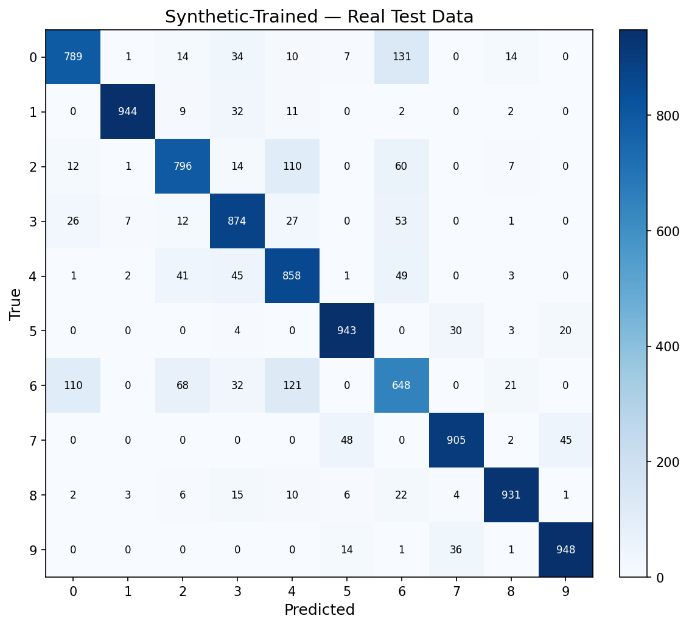
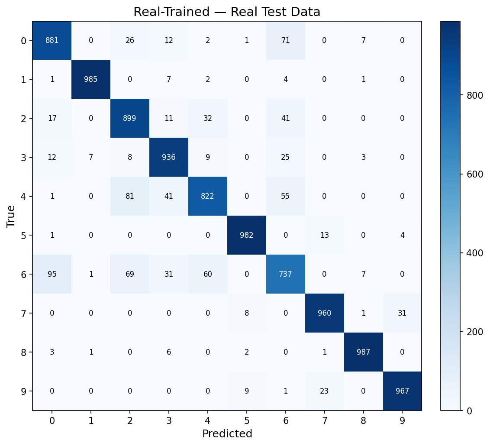
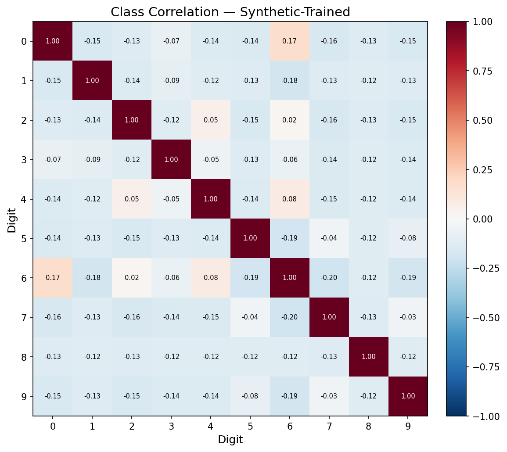

# Flow Matching Image Generator

Image generator using **Flow Matching** based on [An Introduction to Flow Matching and Diffusion Models](https://arxiv.org/abs/2506.02070).

Flow matching learns a vector field that transports samples from Gaussian noise to the data distribution via straight-line (Conditional Optimal Transport) paths. Simpler than classic DDPM — no noise schedules, no reverse SDE, just regression.

Supports both **MNIST** and **Fashion-MNIST** datasets.

## Results

### MNIST

A classifier trained **only on synthetic data** achieves **96.35%** on real test set, vs **99.24%** from real data training (**2.89% gap**).

#### Generated Samples (Epoch 20)



#### Synthetic vs Real Training Accuracy



#### Confusion Matrix (Synthetic-Trained on Real Test Data)



#### Class Correlation Matrix



---

### Fashion-MNIST

A classifier trained **only on synthetic data** achieves **86.36%** on real test set, vs **91.56%** from real data training (**5.20% gap**).

#### Generated Samples (Epoch 50)



#### Synthetic vs Real Training Accuracy



#### Confusion Matrices (Synthetic-Trained vs Real-Trained)

| Synthetic-Trained | Real-Trained |
|---|---|
|  |  |

#### Class Correlation Matrix



---

### Summary

| Dataset | Synthetic-Trained | Real-Trained | Gap |
|---------|:-:|:-:|:-:|
| MNIST | 96.35% | 99.24% | 2.89% |
| Fashion-MNIST | 86.36% | 91.56% | 5.20% |

## Usage

```bash
# Install
pip install -r requirements.txt

# Train on MNIST (20 epochs, ~2 min on RTX 3090)
python train.py --epochs 20

# Train on Fashion-MNIST (50 epochs recommended)
python train.py --dataset fashion --epochs 50 --output-dir ./output_fashion

# Generate images
python sample.py --n-samples 64 --digit 7

# Evaluate: train classifier on synthetic, compare with real
python evaluate.py
python evaluate.py --dataset fashion --model-dir ./output_fashion --output-dir ./output_fashion/eval
```

## Architecture

- **Generator**: U-Net (~2M params) with sinusoidal time embeddings and adaptive normalization
- **Class conditioning**: Learned digit embeddings + classifier-free guidance (CFG)
- **Sampling**: Euler integration, 100 steps, CFG scale 2.0

## Files

| File | Description |
|------|-------------|
| `model.py` | U-Net and CNN classifier architectures |
| `train.py` | Flow matching training loop |
| `sample.py` | Image generation via Euler integration |
| `evaluate.py` | Synthetic vs real data evaluation with plots |
