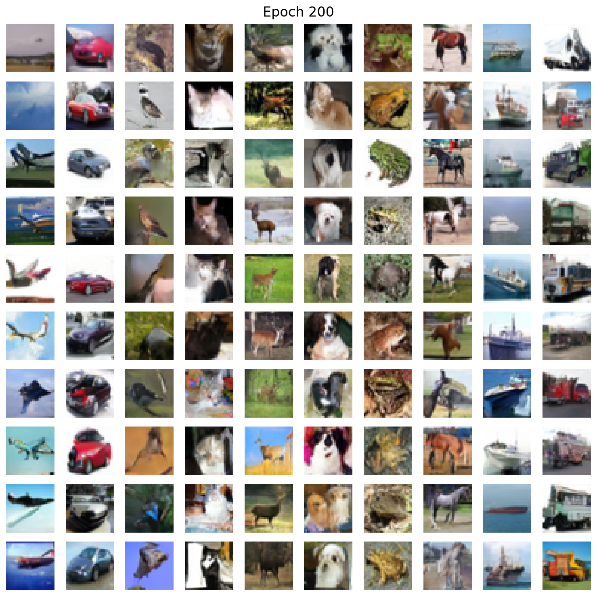
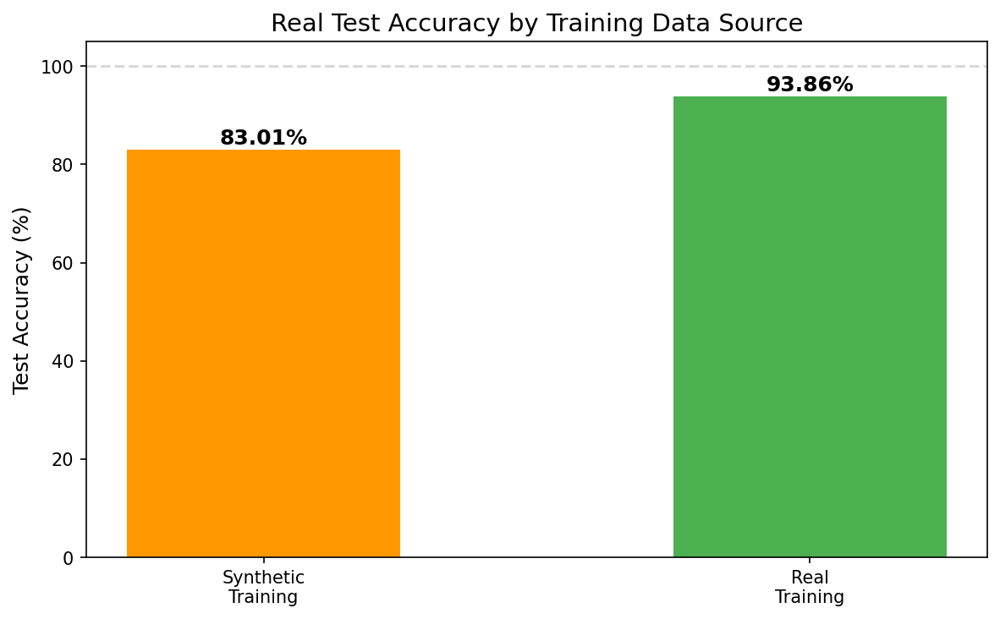
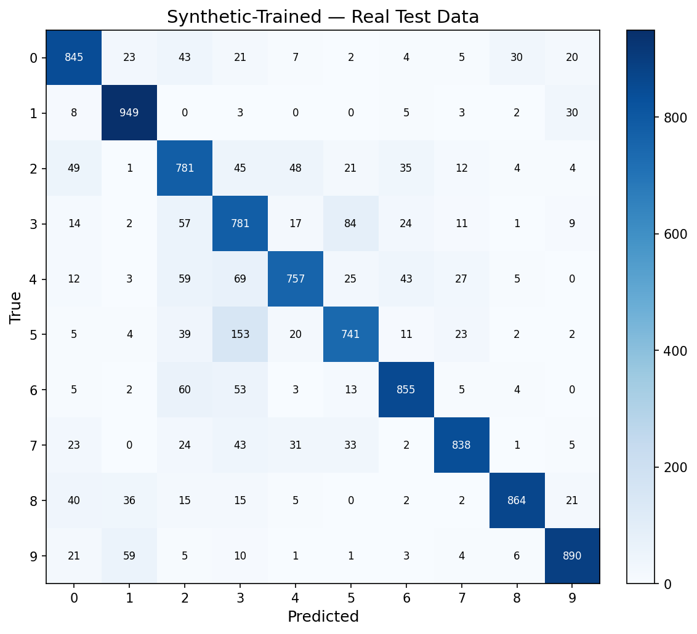
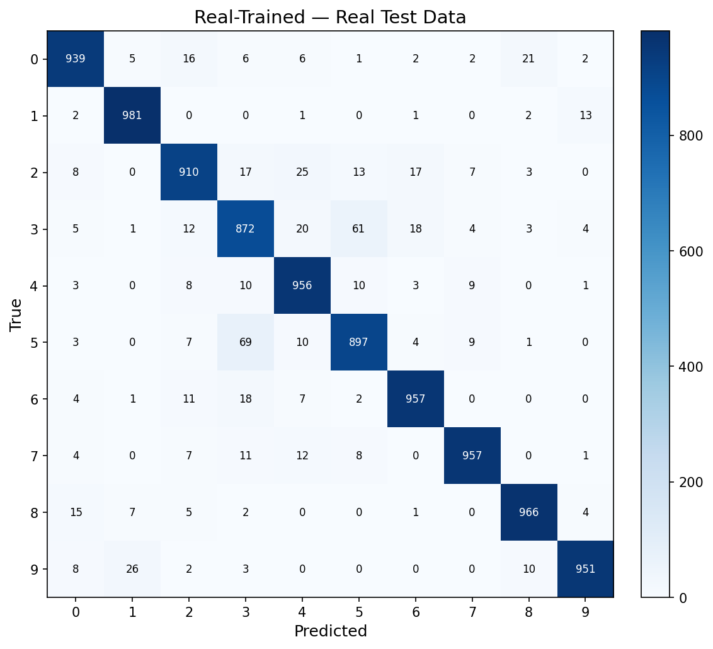

# nano-flow-matching

Minimal implementation of **Flow Matching** for image generation, based on [An Introduction to Flow Matching and Diffusion Models](https://arxiv.org/abs/2506.02070).

Flow matching learns a vector field that transports Gaussian noise to the data distribution via straight-line paths. Simpler than DDPM — no noise schedules, no reverse SDE, just regression.

## Results

We evaluate by training a classifier **only on synthetic data** and testing on real data.

| Dataset | Synthetic-Trained | Real-Trained | Gap |
|---------|:-:|:-:|:-:|
| MNIST | 96.35% | 99.24% | 2.89% |
| Fashion-MNIST | 86.36% | 91.56% | 5.20% |
| CIFAR-10 | 83.01% | 93.86% | 10.85% |

### MNIST


<details>
<summary>Confusion matrix</summary>


</details>

### Fashion-MNIST


<details>
<summary>Confusion matrices</summary>

| Synthetic-Trained | Real-Trained |
|---|---|
|  |  |
</details>

### CIFAR-10




<details>
<summary>Confusion matrices</summary>

| Synthetic-Trained | Real-Trained |
|---|---|
|  |  |
</details>

## Usage

```bash
pip install -r requirements.txt

# Train (MNIST / Fashion-MNIST / CIFAR-10)
python train.py --dataset mnist --epochs 20
python train.py --dataset fashion --epochs 50 --output-dir ./output_fashion
python train.py --dataset cifar10 --epochs 80 --channels 128 --output-dir ./output_cifar10

# Generate images
python sample.py --model-dir ./output --n-samples 64 --digit 7

# Evaluate synthetic vs real
python evaluate.py --dataset mnist
python evaluate.py --dataset fashion --model-dir ./output_fashion --output-dir ./output_fashion/eval
```

## How it works

<details>
<summary>Architecture & method details</summary>

**U-Net** (~2M params for MNIST, ~7M for CIFAR-10) with:
- Sinusoidal time embeddings
- Adaptive scale+shift normalization
- Skip connections
- Class-conditional generation via learned embeddings + classifier-free guidance

**Training**: CondOT interpolation `x_t = t*z + (1-t)*epsilon`, predict target `z - epsilon`, MSE loss.

**Sampling**: Euler integration from `t=0` to `t=1` with 100 steps.
</details>

## Files

| File | Description |
|------|-------------|
| `model.py` | U-Net and classifier architectures |
| `train.py` | Flow matching training loop |
| `sample.py` | Image generation via Euler integration |
| `evaluate.py` | Synthetic vs real data evaluation |
